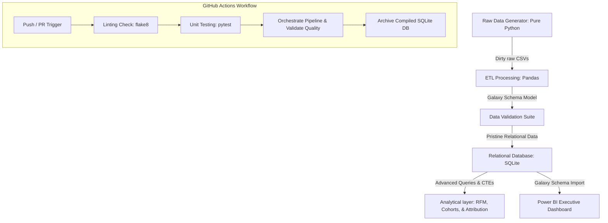

# ApexAnalytics: E-Commerce Multi-Fact Galaxy Schema & Clickstream Pipeline
An end-to-end modern data analytics platform that ingests raw transaction and web session data, executes a robust Python ETL pipeline, models a clean **Galaxy Schema (Fact Constellation)** relational database, performs advanced SQL cohort, RFM, & marketing attribution analytics, and designs a corporate executive Power BI dashboard.

This repository is built to demonstrate industry-grade data engineering, relational database optimization, and high-fidelity business intelligence to recruiters and hiring managers looking for **Senior Data Analyst** capability.

---

## 🏗️ Project Architecture & Data Flow



---

## 🛠️ Tech Stack & Skills Highlighted
* **Python (Data Engineering)**: Standard OOP patterns, custom data generation, robust data cleaning, datetime flexible parsing, clickstream filtering, and dimensional galaxy schema modeling using `pandas`.
* **SQL (Analytics & Modeling)**: Relational table DDL schemas with indexes, advanced CTEs (Common Table Expressions), window functions (`NTILE`, `ROW_NUMBER() OVER (...)`), date parsing, and multi-fact cohort/attribution calculations.
* **CI/CD (DevOps)**: Automated GitHub Actions pipeline validating code format, executing unit tests via `pytest`, and certifying data constraints in automated pipeline builds.
* **Power BI (Business Intelligence)**: Galaxy Schema (Multi-Fact Constellation) data modeling, dynamic DAX measures (YoY Revenue, Time Intelligence, Dynamic Cohort Retention Rate, Clickstream Conversion Rate, Bounce Rate), custom dark slate theme design, and interactive matrices with conditional formatting.

---

## 📁 Repository Structure
```
├── .github/workflows/
│   └── ci_cd.yml                 # Automated testing, linting, & pipeline validation
├── data/
│   ├── raw/                      # Synthetic dirty raw transactional & session data (generated)
│   ├── processed/                # Galaxy Schema dimension & fact CSVs (cleaned)
│   ├── apex_analytics.db         # Final compiled SQLite relational database
│   └── data_validation_report.csv# Automated pipeline quality report
├── power_bi/
│   └── power_bi_playbook.md      # Detailed Power BI Galaxy Schema, DAX, & UI wireframes
├── src/
│   ├── data_generator/
│   │   └── generate_raw_data.py  # Generates dirty transactions & website sessions
│   ├── etl/
│   │   ├── etl_pipeline.py       # Data cleaning, standardizing, & Galaxy Schema model
│   │   ├── db_loader.py          # Compile dataframes into SQLite relational database
│   │   └── data_validation.py    # Automated database data quality & constraints testing
│   └── sql/
│   │   ├── schema_ddl.sql        # Database schema definitions and indexes
│   │   ├── rfm_segmentation.sql  # SQL code for customer RFM tiers classification
│   │   ├── cohort_retention.sql  # SQL code for customer month-over-month retention
│   │   ├── attribution_analysis.sql # SQL code for daily Last-Touch marketing attribution
│   │   └── bigquery_attribution.sql # BigQuery-compatible SQL for cloud attribution
│   ├── run_bigquery_analysis.py  # Cloud query automation & Google OAuth script
│   └── main.py                   # Master orchestration entry-point
├── tests/
│   └── test_etl.py               # Pytest unit tests for the transformation pipeline
├── requirements.txt              # Project library dependencies
├── BEGINNERS_GUIDE.md            # Detailed beginner guide to running & GCP BigQuery setup
└── README.md                     # Main recruiter-facing project page
```

---

## 📊 Business Intelligence & SQL Insights

### 1. Advanced Cohort Retention Analysis
The SQL analytical query (`cohort_retention.sql`) processes transaction dates to establish monthly customer acquisition cohorts and tracks active purchases over time.
* **Key Visual**: Designed for a **Power BI Matrix Heatmap** displaying retention percentage decays.
* **Value**: Enables marketers to identify which months produce the highest lifetime value (LTV) customers and track customer churn rates.

### 2. Recency, Frequency, & Monetary (RFM) Segmentation
The SQL model (`rfm_segmentation.sql`) ranks customers on a 1-5 scale across RFM metrics, segmenting them into actionable marketing cohorts:
* **Champions**: Highly recent, frequent, and high-paying customers. *Strategy: Reward loyalty, launch VIP offers.*
* **At Risk**: Frequent past customers who haven't ordered recently. *Strategy: Re-engagement campaigns.*
* **About to Sleep**: Low recency and frequency. *Strategy: Win-back discounts.*

### 3. Marketing & Web Clickstream Attribution Analysis
The SQL analytical query (`attribution_analysis.sql`) performs session-based marketing attribution by mapping orders directly to the highest-engagement clickstream session that occurred on the exact day of the purchase for that customer (Last-Touch Attribution rule).
* **Key Metrics**: Dynamic Bounce Rate %, Session Conversion Rate %, Revenue per Session, and Average Order Value (AOV) broken down by traffic source (Paid Google Ads, Paid Ads, Social Media, Organic Search, Referral, Direct).
* **Value**: Pinpoints exactly which acquisition channels produce the highest quality traffic and drives conversion rate optimizations.

---

## 🚀 Execution & Verification
1. Review the step-by-step installation and execution flow in [BEGINNERS_GUIDE.md](file:///C:/Users/vaibh/Documents/antigravity/fervent-salk/BEGINNERS_GUIDE.md).
2. Execute the master pipeline:
   ```bash
   python main.py
   ```
3. Run the automated testing suite:
   ```bash
   pytest tests/ -v
   ```
4. Run the automated BigQuery Cloud query directly from your PowerShell terminal:
   ```bash
   python run_bigquery_analysis.py
   ```
5. Check out the [power_bi_playbook.md](file:///C:/Users/vaibh/Documents/antigravity/fervent-salk/power_bi/power_bi_playbook.md) or follow the [BEGINNERS_GUIDE.md](file:///C:/Users/vaibh/Documents/antigravity/fervent-salk/BEGINNERS_GUIDE.md) to complete your Power BI interactive dashboard setup!
