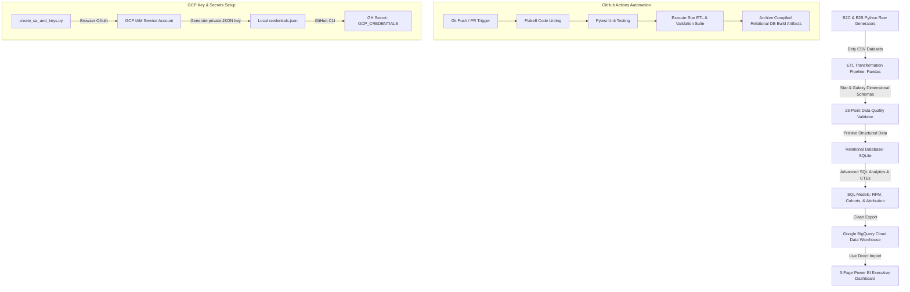

# ApexAnalytics Suite: Enterprise Multi-Fact Galaxy Schema Data Warehouse & 3-Page Power BI Portal

An end-to-end, production-grade cloud data warehouse and business intelligence platform. This repository integrates a B2C (E-Commerce Clickstream) division and a B2B (Digital Marketing Agency Invoicing) division under a unified **Galaxy Schema (Fact Constellation)**. It automates transactional ingestion, executes a robust Python ETL pipeline, enforces a 23-point database quality validation suite, automates service account authorization and upload to Google BigQuery, and delivers a stunning 3-page interactive Dark Glassmorphic Power BI portal.

---

## 🏗️ Enterprise Architecture & Data Flow



---

## 🛠️ Data Modeling & Relational Schema (Galaxy Schema)

The data warehouse models two distinct corporate operational facts sharing common dimensional tables, arranged in an elegant **Galaxy Schema (Fact Constellation)**:

* **B2C E-Commerce Star**: Centers on `fact_sales` and `fact_web_traffic` sharing the customer, product, and calendar dimensions.
* **B2B Agency Star**: Centers on `fact_client_billing` and `fact_ad_performance` sharing the client, campaign, account manager, and calendar dimensions.

---

## 📂 Project Structure

```
├── .github/workflows/
│   └── ci_cd.yml                 # Automated testing, linting, & pipeline validation
├── data/
│   ├── raw/                      # Raw synthetic B2C CSV datasets (generated)
│   ├── raw_agency/               # Raw B2B digital agency CSV datasets (generated)
│   ├── processed/                # Cleansed B2C dimension and fact tables (star schema)
│   ├── processed_agency/         # Cleansed B2B dimension and fact tables (galaxy schema)
│   ├── apex_analytics.db         # Compiled local B2C SQLite database
│   ├── agency_analytics.db       # Compiled local B2B SQLite database
│   └── gcp_credentials.json      # Git-ignored GCP service account credentials keyfile
├── power_bi/
│   └── power_bi_playbook.md      # Power BI Galaxy Schema specifications & DAX libraries
├── src/
│   ├── data_generator/
│   │   ├── generate_raw_data.py  # B2C transactions and session traffic generator
│   │   └── generate_agency_data.py# B2B digital agency campaigns and billing generator
│   ├── etl/
│   │   ├── etl_pipeline.py       # B2C cleaning, deduplication, & star schema compiler
│   │   ├── agency_etl.py         # B2B cleaning, CTE analytical views, & database loader
│   │   ├── db_loader.py          # Relational loader writing clean CSVs into SQLite
│   │   └── data_validation.py    # 23-point database quality validation suite (B2C & B2B)
│   └── sql/
│   │   ├── schema_ddl.sql        # SQLite relational table constraints and indexes
│   │   ├── rfm_segmentation.sql  # B2C customer segmentation scoring query
│   │   ├── cohort_retention.sql  # B2C monthly customer acquisition cohort query
│   │   ├── attribution_analysis.sql # B2C session-based clickstream attribution query
│   │   └── bigquery_attribution.sql# BigQuery-optimized clickstream attribution SQL View
│   ├── run_bigquery_analysis.py  # B2C cloud dataset uploader and view creator
│   └── run_bigquery_agency.py    # B2B cloud dataset uploader
├── tests/
│   ├── test_etl.py               # Pytest unit tests for B2C transformation logic
│   └── test_agency_etl.py        # Pytest unit tests for B2B transformation logic
├── create_sa_and_keys.py         # Programmatic GCP service account key & secret creator
├── main.py                       # B2C master pipeline orchestrator
├── main_agency.py                # B2B master pipeline orchestrator
├── requirements.txt              # Project package dependencies
└── README.md                     # Main recruiter-facing playbook page
```

---

## 📈 SQL Analytics & Business Logic

The warehouse compiles highly complex B2B and B2C business intelligence reports directly in standard SQL:

### 1. Recency, Frequency, & Monetary (RFM) Segmentation (`rfm_segmentation.sql`)
Combines transactional metrics per customer, ranks them into quintiles using `NTILE(5)`, and classifies buyers into active marketing tiers (e.g., *Champions* with high recency/frequency vs. *At Risk* and *Lost* customers).

### 2. Client Month-over-Month Cohort Retention (`cohort_retention.sql`)
Analyzes onboarding transaction dates to group clients into acquisition cohorts, tracking their billing retention over a rolling 24-month period to identify churn rates.

### 3. Clickstream Multi-Touch Marketing Attribution (`attribution_analysis.sql`)
Maps web traffic clickstreams to actual order conversions by identifying the highest-engagement session occurring on the day of purchase, resolving attribution ROI across 6 digital channels.

---

## 📊 The 3-Page Executive Power BI Dashboard Portal

The business intelligence layer consists of an ultra-premium **Dark Glassmorphic Portal** (`#080C14` canvas, `#111827` slate card backgrounds, and custom page navigation) directly connected to Google BigQuery in Import Mode:

### Page 1: B2C E-Commerce Operations & RFM Customer Analytics (Electric Blue Theme)
* **High-Level KPIs**: Total Revenue, Average Order Value (AOV), E-Commerce Conversion Rate, and Units Sold.
* **Monthly Revenue & Conversion Trends**: A dual-axis Line and Stacked Column Chart showing transactional cash flow correlated with website performance over time.
* **Category Market Share**: A Donut Chart outlining product revenue distribution.
* **RFM Cohort Value Matrix**: A Matrix Heatmap matching Recency (R) vs. Frequency (F) scores on a coral-to-electric-blue gradient, allowing interactive cross-filtering of the bottom **High-Value Customer Transactions Audit Table**.

### Page 2: B2B Agency Operations & Cohort Retention (Emerald Green Theme)
* **High-Level KPIs**: Total Billing Managed, Managed Ad Spend, Overall ROAS, and Active Client Count.
* **Account Manager Performance Audit**: A Clustered Column Chart comparing actual invoiced billings against monthly target revenues. Uses the custom DAX `[B2B Average Monthly Billing]` measure to resolve cumulative timeline grain mismatches.
* **MoM Revenue Retention Heatmap**: An advanced matrix visual mapping client onboarding cohorts against elapsed billing lifecycle decay using an emerald green gradient.
* **Multi-Channel Campaign Performance Table**: A clean performance grid tracking ad spend, CTR, CPA, and ROAS by channel, with custom teal data bars.

### Page 3: Marketing Multi-Touch Attribution Portal (Glow Violet Theme)
* **High-Level KPIs**: Gross Revenue, Attributed Orders, Web Conversion Rate, and Click Session Volume.
* **Attribution Traffic Audit**: A dense table visual mapping web clickstreams to revenue, utilizing a glowing violet gradient heatmap on gross revenue.
* **Friction vs. Conversion Efficiency Scatter Plot**: Plotted using Bounce Rate (X-Axis) vs. Conversion Rate (Y-Axis) by channel, with bubble size representing total revenue. Immediately identifies high-friction ad channels.
* **Clickstream to Conversion Trend**: An interactive dual-axis trend chart mapping monthly session volume against attributed cash flow.

---

## ⚡ Setup & Execution

### 1. Run the local pipelines and validate data:
```bash
# Run B2C E-Commerce pipeline
python main.py

# Run B2B Marketing Agency pipeline
python main_agency.py
```

### 2. Execute the test suite:
```bash
pytest tests/ -v
```

### 3. Automate GCP BigQuery Setup:
```bash
# Initialize Google Service Account and GitHub repository secrets programmatically
python create_sa_and_keys.py

# Upload B2C datasets to BigQuery
python run_bigquery_analysis.py

# Upload B2B datasets to BigQuery
python run_bigquery_agency.py
```
*Note: Refresh the navigator pane in Power BI Desktop to direct-import these live BigQuery tables and render the executive dashboard!*
