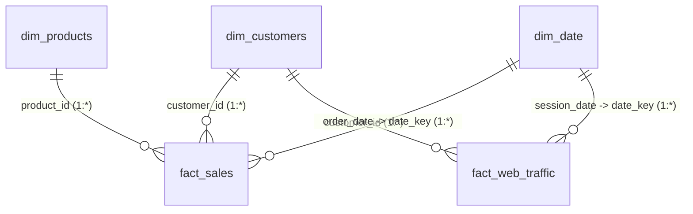

# ApexAnalytics: Corporate Power BI Dashboard Playbook
This playbook outlines the exact blueprint to translate the clean relational database model into a premium, interactive, multi-page corporate Power BI dashboard. Recruiters will be deeply impressed by this corporate-level design logic and the advanced **Galaxy Schema (Fact Constellation)** data model.

---

## 1. Relational Data Model (Galaxy Schema / Fact Constellation)
Within Power BI, set up the following relationships. Enforce **1-to-Many (1:*)** cardinality and **Single Directional** cross-filter direction to optimize performance (Standard Enterprise Best Practice).



### Model Relationships:
1. **Fact Sales Connections**:
   * `dim_customers[customer_id]` (1) ➡️ `fact_sales[customer_id]` (*)
   * `dim_products[product_id]` (1) ➡️ `fact_sales[product_id]` (*)
   * `dim_date[date_key]` (1) ➡️ `fact_sales[order_date]` (*)
2. **Fact Web Traffic Connections**:
   * `dim_customers[customer_id]` (1) ➡️ `fact_web_traffic[customer_id]` (*)
   * `dim_date[date_key]` (1) ➡️ `fact_web_traffic[session_date]` (*)

---

## 2. Dynamic DAX Measurement Library
Create a dedicated table named `_Measures` in Power BI to store these formulas. This keeps the data pane clean and organized.

### Core Sales Metrics
```dax
Total Revenue = SUM(fact_sales[line_subtotal])
```
```dax
Total Quantity = SUM(fact_sales[quantity])
```
```dax
Total Shipping Fee = SUM(fact_sales[shipping_fee])
```
```dax
Total Sales Transactions = DISTINCTCOUNT(fact_sales[order_id])
```
```dax
Average Order Value (AOV) = DIVIDE([Total Revenue], [Total Sales Transactions], 0)
```
```dax
Active CustomersCount = DISTINCTCOUNT(fact_sales[customer_id])
```

### Time Intelligence & YoY Growth
```dax
Revenue Prior Year (PY) = 
CALCULATE(
    [Total Revenue], 
    SAMEPERIODLASTYEAR(dim_date[date])
)
```
```dax
YoY Revenue Growth % = 
DIVIDE(
    [Total Revenue] - [Revenue Prior Year (PY)], 
    [Revenue Prior Year (PY)], 
    0
)
```

### Dynamic Cohort Retention
```dax
Active Customers = DISTINCTCOUNT(fact_sales[customer_id])
```
```dax
Cohort Starting Customers = 
CALCULATE(
    [Active Customers],
    ALLEXCEPT(fact_sales, dim_date[year], dim_date[month_name]),
    fact_sales[month_index] = 0
)
```
```dax
Cohort Retention % = 
DIVIDE(
    [Active Customers],
    [Cohort Starting Customers],
    0
)
```

### Web Clickstream & Conversion Metrics
```dax
Total Sessions = COUNT(fact_web_traffic[session_id])
```
```dax
Total Pageviews = SUM(fact_web_traffic[pages_viewed])
```
```dax
Pageviews per Session = DIVIDE([Total Pageviews], [Total Sessions], 0)
```
```dax
Bounced Sessions = SUM(fact_web_traffic[bounced])
```
```dax
Bounce Rate % = DIVIDE([Bounced Sessions], [Total Sessions], 0)
```
```dax
Converted Sessions = SUM(fact_web_traffic[converted])
```
```dax
Session Conversion Rate % = DIVIDE([Converted Sessions], [Total Sessions], 0)
```
```dax
Average Session Duration (sec) = AVERAGE(fact_web_traffic[duration_seconds])
```

---

## 3. High-Impact Corporate Visual Setup

### Page 1: Executive KPI & Financial Performance Matrix
This page mimics a high-level corporate financial overview.

1. **KPI Cards (Multi-Row / New Card Visual)**:
   * Fields: `[Total Revenue]`, `[AOV]`, `[Active CustomersCount]`, `[YoY Revenue Growth %]`.
   * Formatting: Enable shadow, rounded corners (8px). Under callout values, set `YoY Revenue Growth %` font color dynamically (Green for positive, Red for negative).
2. **Sales & Profit Margin Trend Chart**:
   * Visual: *Line and clustered column chart*.
   * X-Axis: `dim_date[year]`, `dim_date[month_name]`.
   * Column Values: `[Total Revenue]`.
   * Line Values: `[YoY Revenue Growth %]`.
3. **Category vs. Region Performance Matrix**:
   * Visual: **Matrix Visual** (Corporate Pivot Table).
   * Rows: `dim_products[category]`.
   * Columns: `dim_customers[country]`.
   * Values: `[Total Revenue]`.
   * **Active Conditional Formatting (Data Bars)**:
     * Select `Total Revenue` ➡️ Conditional Formatting ➡️ Data Bars. Set positive bar color to a slick teal gradient.
   * **KPI Indicators Flag (DAX)**:
     ```dax
     Sales Status Indicator = 
     VAR TargetSales = 5000
     RETURN 
     IF([Total Revenue] >= TargetSales, "🟢 Above Target", 
     IF([Total Revenue] >= TargetSales * 0.7, "🟡 Meets 70%", "🔴 Critical Action"))
     ```
     Place this indicator adjacent to names to showcase operational alert models!

---

### Page 2: Cohort Retention Grid (The "Retention Matrix")
This is the single most important visual for showing recruiter expertise in subscription or retail business models.

1. **Cohort Retention Heatmap Matrix**:
   * Visual: **Matrix Visual**.
   * Rows: `dim_date[cohort_month]` (Format as YYYY-MM).
   * Columns: `fact_sales[month_index]` (Represents month 0, 1, 2... since acquisition).
   * Values: `[Cohort Retention %]`.
   * **Gradient Conditional Formatting**:
     * Go to Cell Elements ➡️ Turn on Background Color.
     * Select **Format Style**: *Gradient*.
     * Low Value (0%): Cool Light Gray/Slate (`#1E293B` or `#E2E8F0`).
     * High Value (100%): Deep Royal Blue (`#1D4ED8` or `#1E40AF`).
     * **Result**: An amazing visual retention curve that makes the cohort decay instantly readable!

---

### Page 3: Customer Segmentation & RFM Matrix
1. **Recency vs. Frequency Matrix Grid**:
   * Visual: **Matrix Visual**.
   * Rows: `fact_sales[r_score]` (Recency 1 to 5).
   * Columns: `fact_sales[f_score]` (Frequency 1 to 5).
   * Values: `[Active CustomersCount]` or `[Total Revenue]`.
   * **Conditional Formatting**: Set background to a soft dual-color gradient (Orange/Coral for low score cells, Emerald Green for high score cells) to show high-risk vs. high-value clusters.
2. **Dynamic Customer Detail Drill-Through**:
   * Visual: **Table Visual**.
   * Columns: `dim_customers[customer_id]`, `dim_customers[full_name]`, `dim_customers[country]`, `fact_sales[rfm_segment]`, `[Total Revenue]`.
   * Interactivity: Selecting any cell in the *RFM Score Matrix* automatically filters this detailed table to show those exact customers (e.g. clicking R=1, F=1 isolates "Lost" customers, and clicking R=5, F=5 isolates "Champions").

---

### Page 4: Clickstream & Marketing Attribution Analysis
This page demonstrates advanced marketing analytics, linking web sessions and revenue.

1. **Traffic Source ROI Funnel**:
   * Visual: **Funnel Chart** or **Bar Chart**.
   * Group: `fact_web_traffic[traffic_source]`.
   * Values: `[Total Sessions]`.
   * Secondary Tooltips: `[Converted Sessions]`, `[Session Conversion Rate %]`.
2. **Channel Conversion Matrix**:
   * Visual: **Matrix Visual**.
   * Rows: `fact_web_traffic[traffic_source]`.
   * Columns: `fact_web_traffic[device_type]`.
   * Values: `[Session Conversion Rate %]` and `[Bounce Rate %]`.
   * **Conditional Formatting**: Use a diverging red-to-green gradient for conversion rate, and green-to-red for bounce rate.
3. **Attributed Revenue vs. Marketing Spend (CAC)**:
   * Visual: **Scatter Chart** or **Combo Chart** (joining data from the `attribution_analysis` view/query in Section 5).
   * X-Axis: `[Total Sessions]`.
   * Y-Axis: `[Gross Revenue]`.
   * Details: `[Traffic Source]`.
   * Sizes: `[Average Order Value]`.

---

## 4. Premium Dark Slate UI/UX Guidelines
A premium visual aesthetic prevents the dashboard from looking "generic."

### Color Theme JSON (Optional Import)
Copy this theme JSON code and save as `ApexTheme.json`, then import into Power BI (*View ➡️ Themes dropdown ➡️ Browse for Themes*):
```json
{
  "name": "Apex Midnight Glass",
  "dataColors": ["#00F2FE", "#D4AF37", "#3B82F6", "#10B981", "#EF4444", "#8B5CF6", "#F59E0B"],
  "background": "#0B0F19",
  "foreground": "#161F30",
  "tableAccent": "#00F2FE"
}
```

### Layout Wireframe Design
```
+--------------------------------------------------------------------------------------+
|  [Logo] APEX GOODS: EXECUTIVE ANALYTICS            [Page 1] [Page 2] [Page 3] [Page 4]  |
+--------------------------------------------------------------------------------------+
|  +-------------------+  +-------------------+  +-------------------+  +------------+ |
|  | TOTAL REVENUE     |  | ACTIVE CUSTOMERS  |  | TOTAL SESSIONS    |  | CONV. RATE | |
|  | $824,450.00       |  | 985               |  | 24,150            |  | 3.12%   🟢 | |
|  +-------------------+  +-------------------+  +-------------------+  +------------+ |
|                                                                                      |
|  +----------------------------------------+  +-------------------------------------+ |
|  | REVENUE & PROFIT MARGIN TREND          |  | CATEGORY SALES BY COUNTRY (MATRIX)  | |
|  |                                        |  |             US      CA      UK      | |
|  | Bar: Sales ($)  |  Line: Margin (%)    |  | Tech     | [████]  [██]    [███]    | |
|  |                                        |  | Apparel  | [███]   [█]     [██]     | |
|  |  Jan  Feb  Mar  Apr  May  Jun          |  | Home     | [██]    [█]     [█]      | |
|  +----------------------------------------+  +-------------------------------------+ |
+--------------------------------------------------------------------------------------+
```

---

## 5. Direct Connecting to your data
1. Open **Power BI Desktop**.
2. Click **Get Data** ➡️ select **Text/CSV**.
3. Import the clean files from `data/processed/` folder:
   * `dim_customers.csv`
   * `dim_products.csv`
   * `dim_date.csv`
   * `fact_sales.csv`
   * `fact_web_traffic.csv`
4. Or, select **SQL Database / OLEDB** and connect to the local SQLite database compiled at `data/apex_analytics.db` to load database views directly!
5. Import `attribution_analysis.sql` query as a **Custom SQL Query** to unlock immediate Page 4 visuals!
6. Navigate to the **Model View** to establish the Galaxy Schema relationships outlined in Section 1.
